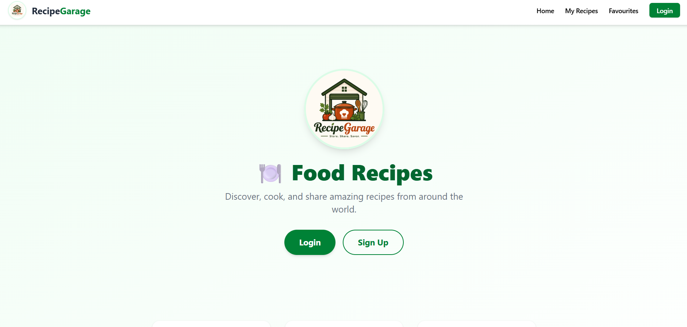
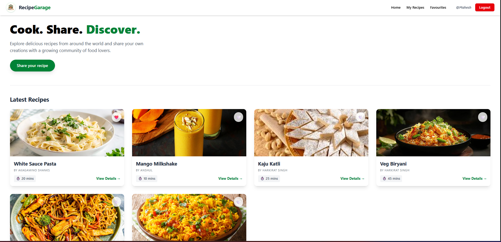
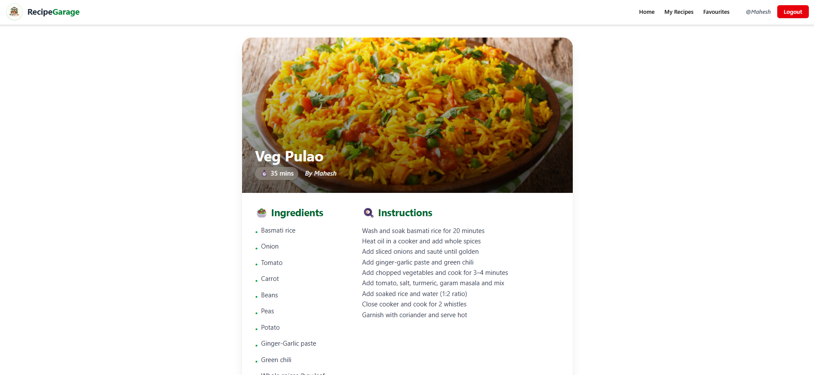
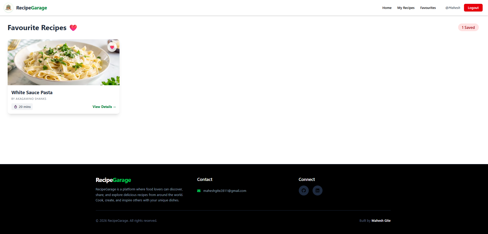

# 🍽️ Recipe Garage

A full-stack recipe sharing platform where food lovers can discover, create, and save their favourite recipes.

🔗 **Live Demo:** [https://recipe-garage.vercel.app](https://recipe-garage.vercel.app)

---

## 📸 Screenshots

### 🏠 Landing Page


### 🔍 Browse Recipes


### 📖 Recipe Details


### ❤️ Favourite Recipes


---

## ✨ Features

- 🔐 **User Authentication** — Secure signup & login with JWT cookie-based sessions
- 🍳 **Add Recipes** — Create recipes with title, ingredients, instructions, cook time & cover image
- 📋 **My Recipes** — Manage all recipes you've created (edit & delete)
- ❤️ **Favourites** — Save and view your favourite recipes from other users
- 🖼️ **Image Upload** — Recipe cover images stored on Cloudinary
- 📱 **Responsive Design** — Works seamlessly on mobile and desktop

---

## 🛠️ Tech Stack

### Frontend
| Technology | Purpose |
|---|---|
| React + Vite | UI framework & build tool |
| Tailwind CSS | Styling |
| React Router | Client-side routing |
| Context API | Global auth state |

### Backend
| Technology | Purpose |
|---|---|
| Node.js + Express | REST API server |
| MongoDB + Mongoose | Database |
| JWT + Cookies | Authentication |
| Bcrypt | Password hashing |
| Cloudinary + Multer | Image storage & upload |

### Deployment
| Service | Purpose |
|---|---|
| Vercel | Frontend hosting |
| Render | Backend hosting |
| MongoDB Atlas | Cloud database |

---

## 🚀 Getting Started

### Prerequisites
- Node.js v18+
- MongoDB Atlas account
- Cloudinary account

### 1. Clone the repository
```bash
git clone https://github.com/Mahesh-Gite-28/RecipeGarage.git
cd RecipeGarage
```

### 2. Setup Backend
```bash
cd backend
npm install
```

Create a `.env` file in the `backend` folder:
```env
PORT=5000
MONGO_URI=your_mongodb_connection_string
JWT_SECRET=your_jwt_secret_key
CLOUDINARY_CLOUD_NAME=your_cloud_name
CLOUDINARY_API_KEY=your_api_key
CLOUDINARY_API_SECRET=your_api_secret
```

Start the backend server:
```bash
node server.js
```

### 3. Setup Frontend
```bash
cd frontend
npm install
```

Create a `.env` file in the `frontend` folder:
```env
VITE_API_URL=http://localhost:5000/api
```

Start the frontend dev server:
```bash
npm run dev
```

Open [http://localhost:5173](http://localhost:5173) in your browser.

---

## 📁 Project Structure

```
RecipeGarage/
├── backend/
│   ├── config/
│   │   ├── db.js              # MongoDB connection
│   │   └── cloudinary.js      # Cloudinary config
│   ├── controller/
│   │   ├── user.js            # Auth logic
│   │   └── recipe.js          # Recipe CRUD logic
│   ├── middleware/
│   │   └── auth.js            # JWT auth middleware
│   ├── models/
│   │   ├── user.js            # User schema
│   │   └── recipe.js          # Recipe schema
│   ├── routes/
│   │   ├── user.js            # Auth routes
│   │   └── recipe.js          # Recipe routes
│   └── server.js              # Express app entry point
│
└── frontend/
    ├── public/
    ├── src/
    │   ├── components/        # All React components
    │   ├── context/
    │   │   └── AuthContext.jsx # Global auth state
    │   ├── utils/
    │   │   └── api.js         # API base URL
    │   ├── App.jsx
    │   └── main.jsx
    └── vite.config.js
```

---

## 🔌 API Endpoints

### Auth
| Method | Endpoint | Description | Auth Required |
|---|---|---|---|
| POST | `/api/signup` | Register new user | ❌ |
| POST | `/api/login` | Login user | ❌ |
| POST | `/api/logout` | Logout user | ❌ |
| GET | `/api/user` | Get current user | ✅ |

### Recipes
| Method | Endpoint | Description | Auth Required |
|---|---|---|---|
| GET | `/api/` | Get all recipes | ❌ |
| GET | `/api/:id` | Get single recipe | ❌ |
| POST | `/api/addRecipe` | Add new recipe | ✅ |
| PATCH | `/api/:id/edit` | Edit recipe | ✅ |
| DELETE | `/api/:id/delete` | Delete recipe | ✅ |
| GET | `/api/myRecipe` | Get my recipes | ✅ |
| GET | `/api/favRecipe` | Get favourites | ✅ |
| POST | `/api/:id/favourite` | Toggle favourite | ✅ |

---

## 🌐 Deployment Notes

This app uses **cross-origin cookie authentication** (Vercel frontend + Render backend). The login cookie is set with:
```js
{ httpOnly: true, secure: true, sameSite: "None" }
```
This is required for cookies to work across different domains in production.

---

## 👨‍💻 Author

**Mahesh Gite**
- GitHub: [@Mahesh-Gite-28](https://github.com/Mahesh-Gite-28)

---

## 📄 License

This project is open source and available under the [MIT License](LICENSE).
